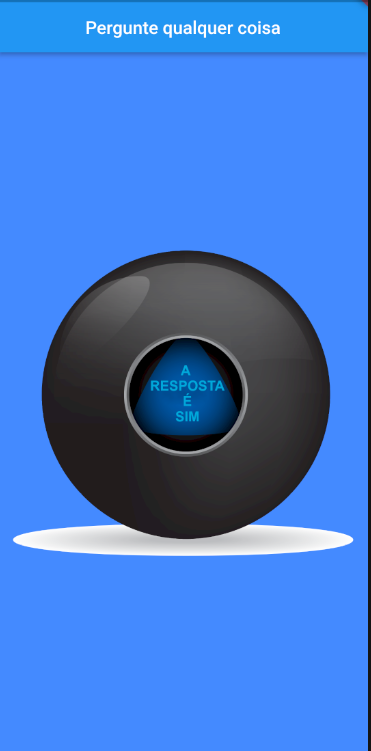
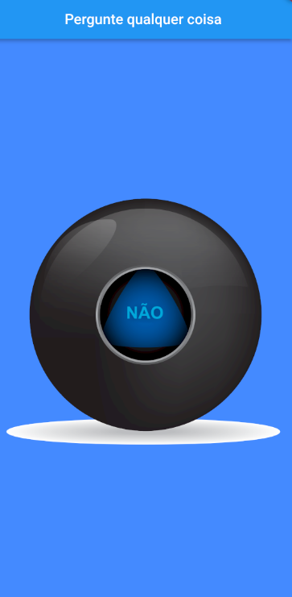
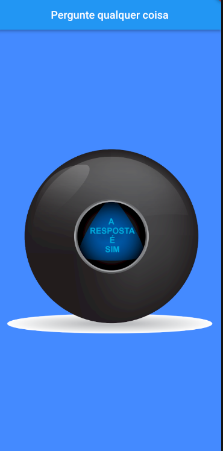
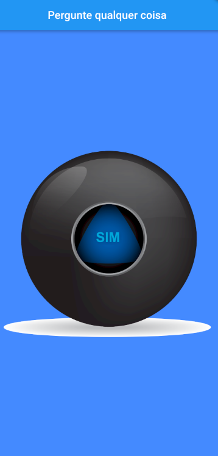

# Bola Mágica Virtual

## Descrição do Projeto

A Bola Mágica Virtual é um emocionante projeto que recria a famosa "Bola 8 Mágica" em um ambiente digital interativo. Inspirado na versão física deste icônico brinquedo, o nosso projeto traz um toque moderno à experiência clássica de fazer perguntas e receber respostas enigmáticas.

## Recursos Principais

- **Respostas Mágicas**: A Bola Mágica Virtual apresenta uma seleção diversificada de respostas, desde as enigmáticas até as hilárias. Os usuários podem fazer perguntas e obter respostas surpreendentes e inesperadas.

- **Interface de Usuário Atraente**: Uma interface de usuário intuitiva e atraente é projetada para criar uma experiência envolvente. Os usuários podem agitar a "bola" virtual ou clicar para revelar suas respostas.

- **Personalização**: Os usuários têm a opção de personalizar a experiência escolhendo diferentes temas, cores e estilos para a "bola", tornando-a única e divertida.

- **Compartilhamento Social**: O projeto permite que os usuários compartilhem suas perguntas e respostas engraçadas ou curiosas nas mídias sociais, tornando-o perfeito para interações sociais e entretenimento.

## Objetivos

- Proporcionar uma experiência divertida e interativa que remete à nostalgia da Bola 8 Mágica clássica.

- Criar um aplicativo leve e acessível que possa ser usado em dispositivos móveis e desktops.

- Oferecer uma ampla variedade de respostas mágicas para atender a todos os gostos e curiosidades.

- Promover momentos de diversão e descontração para os usuários.

## Público-Alvo

A Bola Mágica Virtual é voltada para pessoas de todas as idades que procuram uma maneira descontraída de tomar decisões, buscar conselhos divertidos ou simplesmente se entreter com respostas surpreendentes.

## Nota

Este projeto é uma versão digital da famosa Bola 8 Mágica e é destinado exclusivamente para fins de entretenimento e diversão. Não deve ser utilizado para tomar decisões importantes ou sérias.

## Captura de Tela

